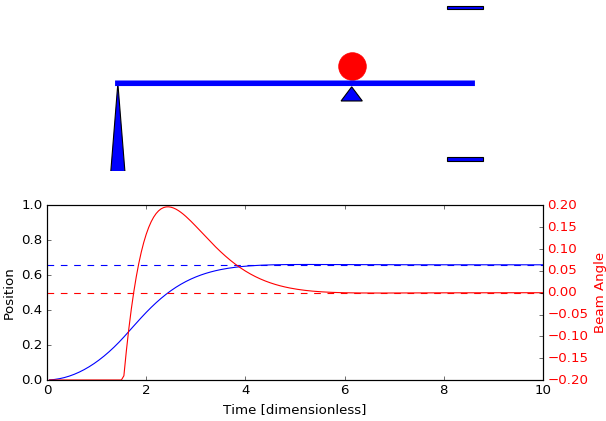

Balancing a Ball on a Beam with Proportional-Derivative Control
===============================================================

*Balancing a Ball on a Beam with Proportional-Derivative Control* is an interactive demonstration of feedback control for a ball and beam system. It is intended for use as lecture demonstration of proportional and proportional-derivative control, and to reinforce control concepts through homework exercises. It was originally written in Matlab in 2001, and revised in 2011 for the then-current version of Matlab, and rewritten as a Jupyter/Python notebook in 2016.

## Running

You can open and run the notebook directly from a browser window by clicking on this button:

This will open the notebook in your browswer with calculations done in the 'cloud'.  This is the most convenient way to use the notebook without installing anything on your own computer, tablet, or phone.

## Downloading

The demonstration is self-contained in a single Jupyter notebook. If you have Jupyter/Python installed on your computer, you can download by opening the notebook on github and clicking the download icon.

Alternatively, you can fork or clone the whole project from this [github repository](http://jckantor.github.io/Ball-and-Beam/).
